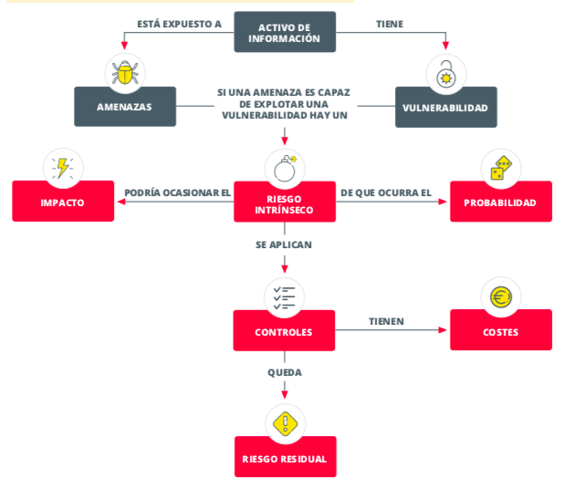
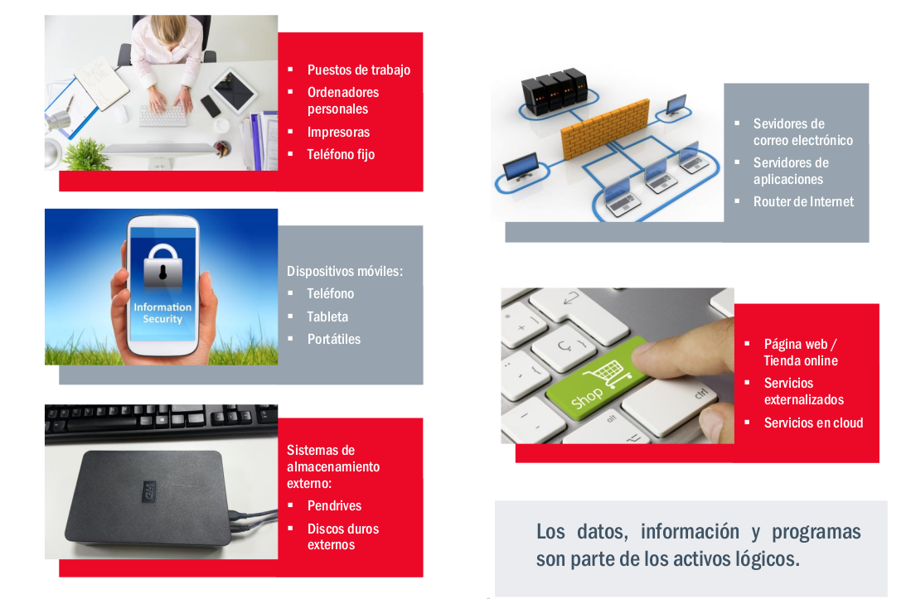

# Incidentes de seguridad
## Unidad 1: Principios generales de la ciberseguridad
**Ciclo de Especialización de FP en Ciberseguridad en Entornos de las Tecnologías de la Información**

---

# Investiga y desarrolla: Análisis de riesgos.

Mediante el plan director se aborda, desde la estrategia general de la organización, los principios generales de la organización en materia de seguridad. Además este plan tiene que ser conocido y aprobado por la dirección de la organización. Durante la creación de este plan director de seguridad se realiza un análisis de riesgos para identificar la situación de la empresa.

La empresa que ya conoces, y en la que tuvieron una experiencia desagradable con un malware ha decidido trabajar en mejorar su seguridad.  Para ello ha decidido realizar una consultoría para realizar un plan director de seguridad que permita abordar los posibles riesgos y realizar una gestión planificada de las actuaciones en materia de ciberseguridad.

Para llevar a cabo el plan director, antes trabajaremos en el análisis de riesgos. Recordemos las características de la empresa.

## Descripción de la empresa

La empresa sobre la que se va a realizar el PDS se dedica a asesorar a autónomos y pymes.

Está formada por 150 empleados, distribuidos en 2 sedes. Tiene departamentos de facturación y ventas, compras, comunicación y RRSS, TIC, RRHH, Delivery, Mantenimiento,  Legal y un consejo de administración. Cada uno de ellos con un responsable, también existe un responsable de seguridad para la coordinación de las subcontratas de seguridad de las distintas sedes.

En cuanto a la ubicación física, tienes dos sedes. La primera sede y principal, es un edificio ocupado al completo por nuestra empresa. La segunda sede esta localizada en una segunda planta de un edificio en el que existen mas empresa. En ambas sedes es habitual la visita de personal externo: clientes, proveedores, subcontratas, etc.

Como algo a destacar, ha desarrollado un plan estratégico de transformación digital, para extenderse y realizar la mayoría de sus trabajo a través de Internet, apoyándose en la pagina web.

**La empresa tiene oficinas con**:

- Puestos de trabajo: PC, impresoras, teléfonos,…
- Dispositivos móviles: portátiles, móviles y tabletas
- Sistemas de almacenamiento externo: discos, pendrives,…

Además, en cuanto a los servicios TIC:

- Se utilizan servicios en la nube (servicios gestionado de aplicaciones y almacenamiento).
- En las instalaciones de la empresa también hay:   

    - Servidores de correo electrónico 
    - Servidores de archivos y aplicaciones
    - Conexión a Internet, routers ,…, wifi

En cuanto a la información y datos que maneja la empresa:

- Distintos tipos de datos e información (Esta información, se encuentra tanto en servidores locales como en la nube) referentes a:
    - Datos personales de clientes y proveedores.
    - Datos de funcionamiento y gestión de la empresa.
    - Propiedad intelectual.
    - Procesos internos en aplicaciones CRM, ERP, etc.

Otros activos importantes de la empresa son:

En cuanto a la forma de trabajar de la empresa:

- Tiene una página web y tienda online (alojada en un proveedor externo), a través de la cual los clientes contactan con la empresa para que realicen trabajos.
- Se utilizan las redes sociales para darse a conocer y mostrar su cartera de servicios.

Por último, en cuanto a los controles de seguridad existentes en la empresa:

- La seguridad física corre a cargo de una empresa externa. En la primera sede es una empresa subcontratada, en la 2 sede es un servicio mas del edificio en el que se aloja la empresa.
- La situación en cuento a controles de la empresa, es básica.
- Se realizan copias de seguridad, gestionadas por los empleados del departamento TIC, que se almacenan en la sede principal. Este proceso está documentado con de forma básica, tal que permite repetir el procedimiento.
- Existe antivirus gestionado por una subcontrata que se encarga de que esté actualizado, con un procedimiento documentado pero que no ha sido aprobado por la dirección.
- Cumplimiento de la RGPD a través de la contratación de una consultoría. Bien documentado tras el trabajo de la consultoría, aprobado por la dirección y formal.
- Existe un firewall que establece una zona segura y otra publica en la red de la empresa. La subred segmentada por departamentos. Toda esta información solo la conoce el administrador de red.
- Actuálmente no existen políticas de seguridad por escrito.
- La página web está externalizada y no tiene control sobre su estado en cuanto a securización.

## Enlaces de apoyo

- https://revilofe.github.io/section2/u01/teoria/IS-U1.2.2.-AnalisiDeRiesgos/
- https://www.incibe.es/sites/default/files/contenidos/guias/doc/guia_ciberseguridad_gestion_riesgos_metad.pdf
- [Recursos adicionales](recursos/)
- [Guia markdown](https://docs.google.com/document/d/1VFO2l-229O-Go8pSscavNNXCAoMnr5-pFsXh1weG6wI/edit?tab=t.0)

## Evaluacion

- Define unos objetivos a alcanzar asociados a la estrategia de la empresa y justificado, definiendo un alcance. Siempre teniendo presente la Integridad, confidencialidad y disponibilidad.

- Identifica los activos más importantes asociados al alcance definido.

- Identifica las amenazas que pueden afectar a los activos.

- Identifica las vulnerabilidades y salvaguardas existentes.

- Analiza adecuadamente los riesgos: Activos/Vulnerabilidades/Amenazas

- Obtiene riesgos y estrategias para trabajar los riesgos, finalmente identificando los riesgos residuales y asumibles.

## Entrega

Utiliza la plantilla adjunta en [AnalisisDeRiestgos.md](AnalisiDeRiesgos.md) para realizar el análisis de riesgos, documentando adecuadamente cada apartado y las conclusiones obtenidas.   

En el mismo documento, no olvides identificar los miembros del equipos y la responsabilidad de cada uno en el trabajo.   

Además, puedes hacer uso de los siguientes anexos para apoyar tu análisis:
- Excel's de trabajo en [plantillas](plantillas/)

Entrega el enlace a este repositorio con el análisis de riesgos realizado en la moodle del curso, antes de la fecha y hora indicada.
